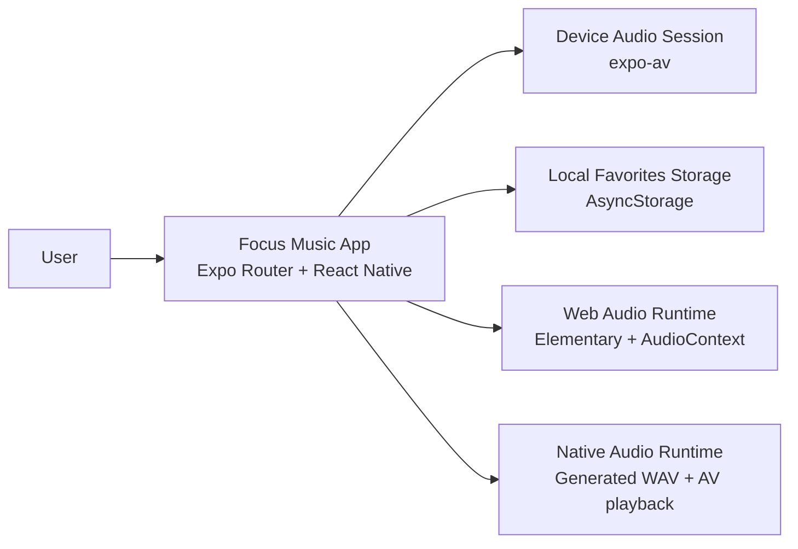
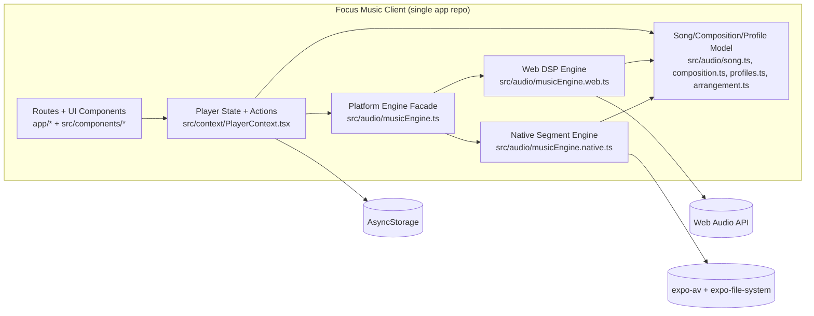
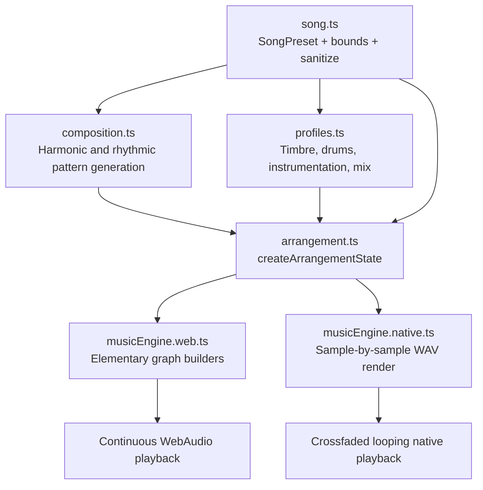
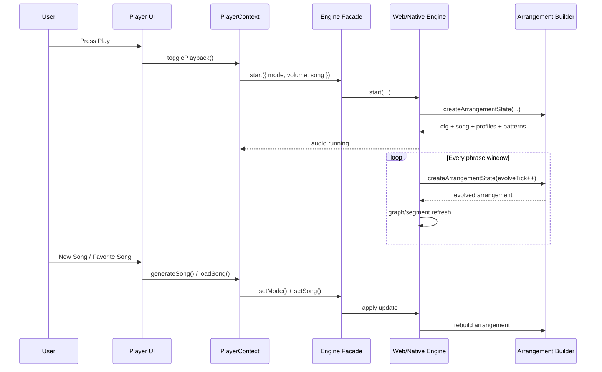

# Focus Music Architecture

This document gives a shared architecture map for roadmap work. Diagrams use Mermaid and follow a C4-style breakdown.

## C4 Level 1: System Context

## C4 Level 2: Containers

## C4 Level 3: Component View (Audio Generation Domain)

## Runtime Sequence: Play, Evolve, and Song Switch

## Roadmap Mapping

These diagram boundaries map directly to future workstreams:

- Song quality and musicality: `song.ts`, `composition.ts`, `profiles.ts`, `arrangement.ts`
- Engine rendering and mix glue: `musicEngine.web.ts`, `musicEngine.native.ts`
- UX and session workflow: `PlayerContext`, `app/index.tsx`, `app/player.tsx`
- Persistence and recall: favorites storage + preset schema compatibility
